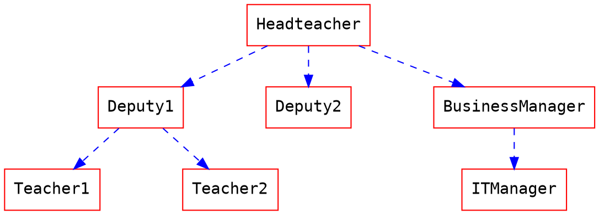

hackmd第一篇文章
===

[hackmd.io](https://hackmd.io)  
很方便的同步github的仓库里的md文章,  
写起来还是挺舒服的
### 简单修改

支持数学公式  
``` bash
yarn add hexo-filter-mathjax
#  _config.yml 添加配置，使用方式看文章下方的“数学公式”章节
# ps： 文章页meta信息添加：mathjax: true
mathjax:
  tags: none # or 'ams' or 'all'
  single_dollars: true # enable single dollar signs as in-line math delimiters
  cjk_width: 0.9 # relative CJK char width
  normal_width: 0.6 # relative normal (monospace) width
  append_css: true # add CSS to pages rendered by MathJax
  every_page: false
```

支持Graphviz  
```
yarn add https://github.com/dwatow/hexo-filter-viz.git
```

### 代码块
``` python
import os
class TestClass:
    foo='bar'
    
if __name__ == '__main__':
    print("hello world")
```
### 表格

| Column 1 | Column 2 | Column 3 |
| -------- | -------- | -------- |
| Text     | Text     | Text     |

### 图片


### 链接
[google](https://www.google.com)
### 列表
1. 项目1
2. 项目2

* 条目1
* 条目2

- [ ] todo1
- [ ] todo2

### 数学公式

$$
x = {-b \pm \sqrt{b^2-4ac} \over 2a}.
$$

$$
\Gamma(z) = \int_0^\infty t^{z-1}e^{-t}dt\,.
$$

### 流程圖

您可以像是以下使用流程圖：
```flow
st=>start: 開始
e=>end: 結束
op=>operation: 我的操作
op2=>operation: 啦啦啦
cond=>condition: 是或否？

st->op->op2->cond
cond(yes)->e
cond(no)->op2
```

### Graphviz

